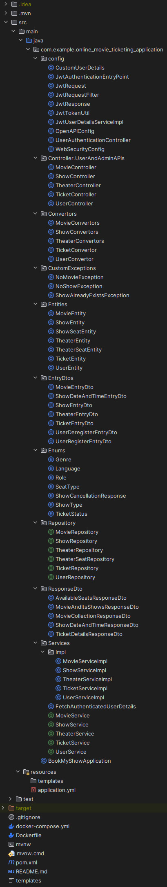
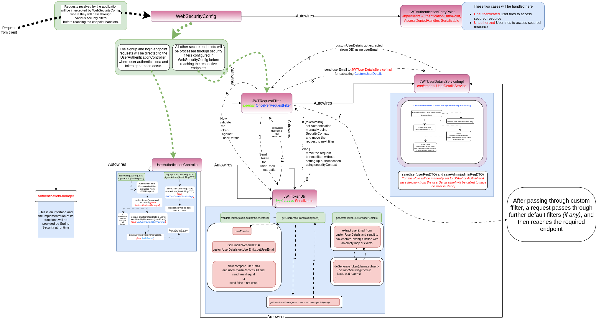
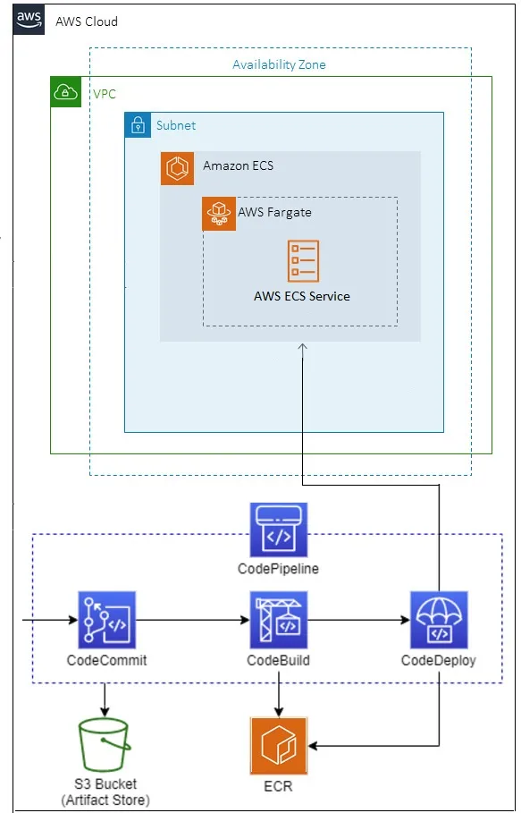
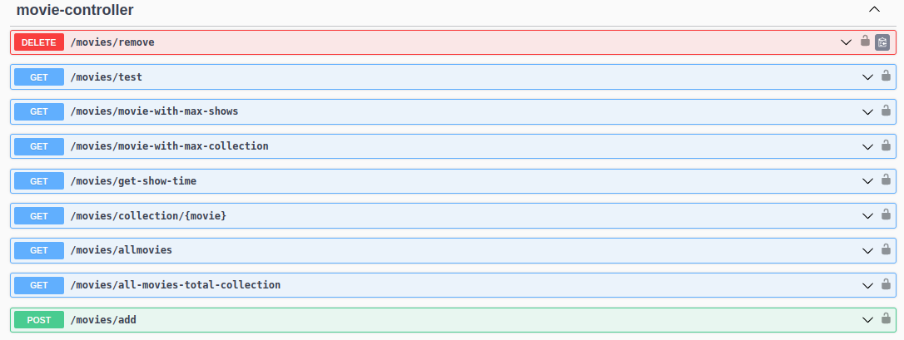
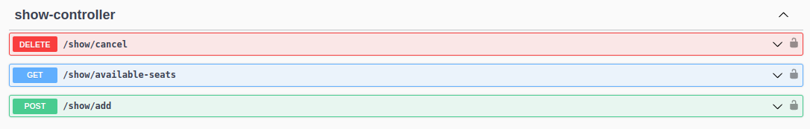
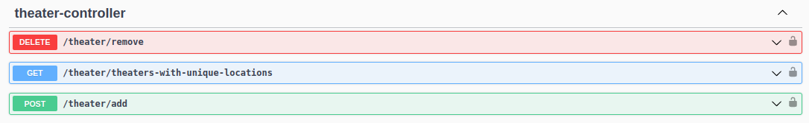
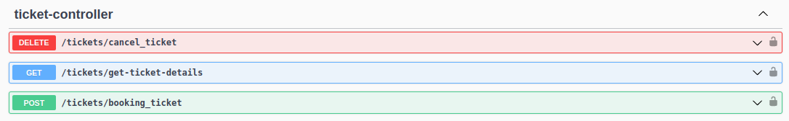

# BOOKNOW - An online movie ticketing application 
## This repository contains the backend code for the BOOKNOW - An online movie ticketing application
This is a Spring Boot application with around 26 APIs for performing all the CRUD operations related to ticketing of a movie show in a theater.

## Features of this Application
**Secure Endpoints:** <br> *Utilized Spring Security for robust endpoint security, protecting against unauthorized access.*

**JWT Authentication:** <br> *Implemented JWT-based authentication management for secure user access.*

**Containerization of the Application:** <br> *Containerized this application for seamless deployment anywhere, be it cloud or your local server etc.*

**CI/CD on AWS:** <br> *Utilized AWS CodePipeline (CodeCommit, CodeBuild and CodeDeploy) for deploying this backend application on
AWS*


_________________________________________________
# Table of Contents
_________________________________________________

- [Instructions for Running this Project on your Computer](#Instructions-for-Running-this-Project-on-your-Computer)
  * [Prerequisites](#Prerequisites)
  * [How to Run](#how-to-run)
  * [Additional Notes](#additional-notes)
- [Design of the Application](#design-of-the-application)
- [Flow Process of Authentication and Authorization Mechanism](#Flow-Process-of-Authentication-and-Authorization-Mechanism)
- [Database Schema (EER Diagram)](#Database-Schema-eer-diagram))
- [CI/CD Setup Diagram on AWS](#CICD-Setup-Diagram-on-AWS)
- [API Description](#API-Description)
- [Steps to perform operations](#Steps-to-perform-operations)
- [Tech Stack](#Tech-Stack)
- [Conclusion](#Conclusion)
- [Contact](#Contact)

_________________________________________________
# Instructions for Running this Project on your Computer
_________________________________________________

## Prerequisites

Make sure you have the following tools installed on your machine:

- [Docker](https://docs.docker.com/get-docker/)
- [Docker Compose](https://docs.docker.com/compose/install/)
- [JDK 17 or higher](https://www.oracle.com/java/technologies/downloads/#java17)
- [Maven 3.2.0](https://maven.apache.org/install.html)

## How to Run

1. Clone the repository to your local machine:

    ```bash
    git clone https://github.com/PranshuBarar/BOOKNOW.git
    ```

2. Navigate to the project directory:

    ```bash
    cd <respository_name_here>
    ```

3. Run Docker Containers of MySQL and Spring Boot Application:

   ```bash
    docker build -t book-now-application .
    ```
    
   ```bash
    docker compose up
    ```

4. Access the application at [http://localhost:8080/springboot3/swagger-ui/index.html#/](http://localhost:8080/springboot3/swagger-ui/index.html#/)

## Additional Notes

- If you encounter any issues, ensure that ports 8080 and 3306 are available on your machine.

- Customize your application configuration in the `application.properties` files if you require doing so.

- You are most welcome to explore other available endpoints and functionalities as documented in the project.


_________________________________________________
# Design of the Application
_________________________________________________


_________________________________________________
# Flow Process of Authentication and Authorization Mechanism
_________________________________________________


You can have a dynamic look of this flow process by clicking here:
[https://jwtworking.s3.ap-south-1.amazonaws.com/JWTDesignUpdated.drawio+-+Page-1.html](https://jwtworking.s3.ap-south-1.amazonaws.com/JWTDesignUpdated.drawio+-+Page-1.html)

_________________________________________________
# Database Schema (EER Diagram)
_________________________________________________


_________________________________________________
# CI/CD Setup Diagram on AWS
_________________________________________________


_________________________________________________
# API Description
_________________________________________________

This Movie Booking application can do the following tasks : 

* USERS AUTHENTICATION CONTROLLER
  * Users can register themselves on the application (as USER)
  * Users can register themselves on the application (as ADMIN)
  * Users can login on the application (as USER)
  * Users can login on the application (as ADMIN)
  
  

* MOVIE
  * Remove a movie from the database
  * Get Movie with max shows
  * Get Movie with max collection
  * Get show time with the help of TheaterName and MovieName
  * Get total Collection of a Movie
  * Get list of all the movies
  * Get list of all the movies with their total collection
  * Add a new movie in the database
  
  


* SHOW
  * Cancel a show for a movie
  * Get Available seats for a show
  * Add a Show for a particular movie 
  
  


* THEATER
  * Remove a theater from the database.
  * Get theaters with unique locations.
  * Add a new theater in the database.

  
  

* TICKET
  * Users can cancel the ticket before the showdate.
  * Get details of a ticket using ticketId
  * Users can book a ticket for the movie. (User can book multiple seats on the same ticket)
  
  

_________________________________________________
# Tech Stack
_________________________________________________
This project uses the following tech stack:
* [Spring Boot](https://spring.io/projects/spring-boot)
* [Spring Security](https://spring.io/projects/spring-security/)
* [Hibernate](https://hibernate.org/)
* [MySQL](https://www.mysql.com/) (For Database)
* [OpenAPI (for API Documentation)](https://www.openapis.org/)
* [Docker for Containerization](https://www.docker.com/)
_________________________________________________
# Conclusion
_________________________________________________
This ONLINE-MOVIE-TICKETING-APPLCIATION provides a strong backend infrastructre to do CRUD operations and managing the database. I always keep updating the features of this application as my learning process. Right Now I am working on having a basic login/signup page with Oauth2.0 support for social login and signup. I am trying to build a basic frontend setup for login/signup page using React.js.

_________________________________________________
# Contact
_________________________________________________
For questions, feedback, or support, please contact the project owner at pranshubarar1851996@gmail.com.


